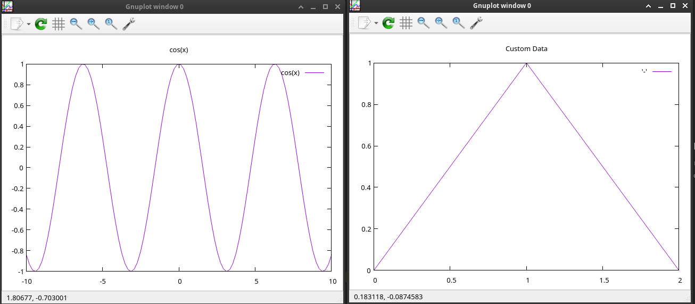

# gnuplot-wrapper

C# wrapper over `gnuplot` util.

http://www.gnuplot.info/

https://sourceforge.net/p/gnuplot/gnuplot-main/ci/master/tree/

1. Install gnuplot

```csharp
$ apt install gnuplot
```

2. Install nuget package
https://www.nuget.org/packages/GnuPlotWrapper

## Example of code 
```csharp

// Start first gnuplot window
using GnuPlotWrapper;

using var window0 = new GnuPlot();
window0.Start();

// Plot sin(x)
await window0.ExecuteAsync(@"set title 'sin(x)'".AsMemory());
await window0.ExecuteAsync(@"plot sin(x) ".AsMemory());

// Start second gnuplot window 
using var window1 = new GnuPlot();
window1.Start();

// Plot custom data in second window
await window1.ExecuteAsync(@"set title 'Custom Data'".AsMemory());
await window1.ExecuteAsync(@"plot '-' with lines ".AsMemory());
await window1.ExecuteAsync("0 0".AsMemory());
await window1.ExecuteAsync("1 1".AsMemory());
await window1.ExecuteAsync("2 0".AsMemory());
await window1.ExecuteAsync("e".AsMemory());

// Update first window to plot cos(x)
await window0.ExecuteAsync(@"set title 'cos(x)'".AsMemory());
await window0.ExecuteAsync(@"plot cos(x) ".AsMemory());

// Kill both gnuplot windows before exiting the program
// await window0.KillAndWaitForExitAsync();
// await window1.KillAndWaitForExitAsync();


Console.WriteLine("Exiting...");
```


